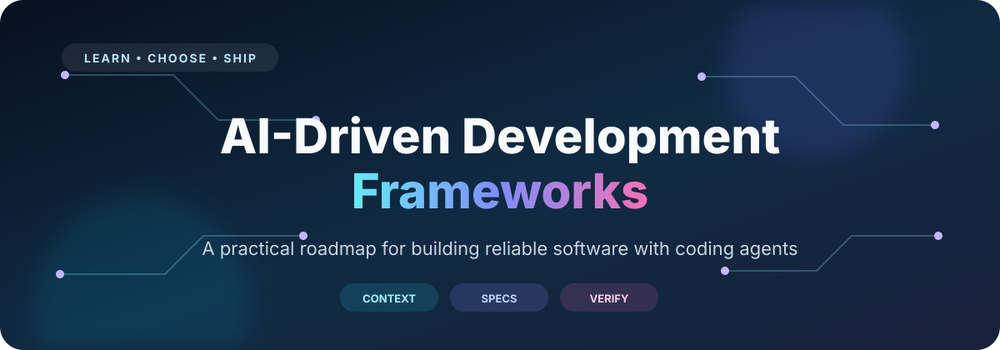
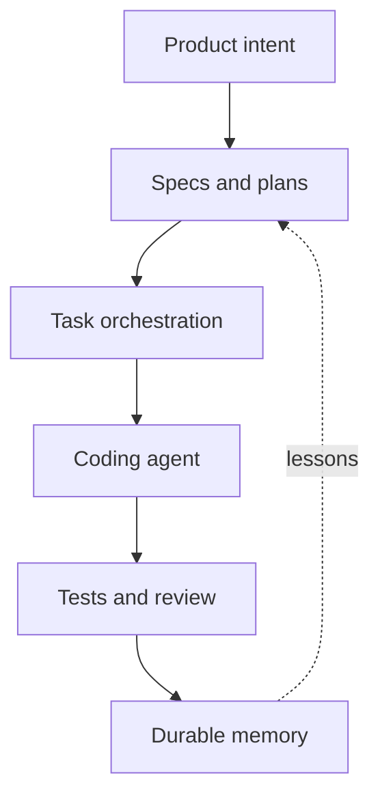

  

   

  
  
  
  
  

  **Learn the systems behind reliable AI-assisted software development—not just better prompting.**

  [Start learning](#start-in-10-minutes) · [Choose a framework](docs/choose-a-framework.md) · [Follow the roadmap](docs/learning-roadmap.md) · [Contribute](CONTRIBUTING.md)

---

AI coding tools can write code. The difficult part is making them preserve intent, respect architecture, manage context, verify their own work, and remain useful after the first impressive demo.

This open-source guide maps the frameworks and engineering practices that solve those problems. It is for developers using **Cursor, Claude Code, Codex, GitHub Copilot, Windsurf, OpenCode**, or another coding agent to build real products.

> [!IMPORTANT]
> This guide covers **frameworks for building software with AI coding agents**. It does not compare application-agent libraries such as LangGraph, AutoGen, CrewAI, or Semantic Kernel.

## Table of contents

- [Start in 10 minutes](#start-in-10-minutes)
- [The AI development stack](#the-ai-development-stack)
- [Framework map](#framework-map)
- [Choose by goal](#choose-by-goal)
- [Learning paths](#learning-paths)
- [What makes this guide different](#what-makes-this-guide-different)
- [Documentation](#documentation)
- [Contributing](#contributing)
- [Project status](#project-status)

## Start in 10 minutes

You do not need a large framework on day one. Establish a reliable baseline first:

- [ ] Add an [`AGENTS.md`](https://agents.md/) with setup, test, architecture, and boundary instructions.
- [ ] Make the agent produce a plan before any multi-file change.
- [ ] Define an executable success signal: tests, type-checking, linting, a build, or a reproducible manual check.
- [ ] Keep one feature small enough to review in a single diff.
- [ ] Ask a fresh reviewer—human or agent—to inspect the change against the requirement.
- [ ] Record reusable corrections as rules, tests, or decisions instead of leaving them in chat history.

Then complete the [full learning roadmap](docs/learning-roadmap.md) and choose a framework only for the problem you actually have.

## The AI development stack

A coding agent is only one layer of a dependable system:

| Layer | Question it answers | Typical mechanism |
|---|---|---|
| Intent | What are we building, for whom, and why? | Product brief, PRD, acceptance criteria |
| Context | What must the agent know about this repository? | `AGENTS.md`, rules, architecture docs |
| Capability | How should a repeatable task be performed? | Agent Skills, plugins, scripts |
| Specification | What behavior must this change produce? | OpenSpec, Spec Kit, BMAD, cc-sdd |
| Orchestration | How is work divided, resumed, and coordinated? | GSD Core, BMAD, Task Master, Archon |
| Execution | How does implementation iterate toward completion? | Superpowers, Ralphy, native agent loops |
| Verification | What proves the result is correct? | Tests, static analysis, review, evals |
| Memory | What should survive the current conversation? | Versioned docs, decisions, corrections, state files |

The strongest workflow assigns **one clear owner to each layer**. Installing three planning frameworks rarely produces three times the quality.

## Framework map

The ratings below describe workflow weight, not quality. “High” means more artifacts, gates, or infrastructure.

| Framework | Primary job | Best fit | Weight | Starter guide |
|---|---|---|:---:|---|
| **GSD Core** | Context-engineered project lifecycle | Solo developers shipping multi-phase work | Medium | [Start](docs/frameworks/gsd-core.md) |
| **BMAD Method** | Product-to-delivery AI workflow | Complex products needing deep discovery | High | [Start](docs/frameworks/bmad-method.md) |
| **OpenSpec** | Living, change-oriented specifications | Existing products and incremental features | Low–Medium | [Start](docs/frameworks/openspec.md) |
| **GitHub Spec Kit** | Constitution-to-implementation SDD | Formal greenfield and team workflows | Medium–High | [Start](docs/frameworks/spec-kit.md) |
| **Superpowers** | TDD, debugging, planning, and review discipline | Improving implementation quality | Medium | [Start](docs/frameworks/superpowers.md) |
| **Agent OS** | Discover and inject engineering standards | Consistency across projects and teams | Low | [Start](docs/frameworks/agent-os.md) |
| **Task Master** | PRD-to-task management | Dependency-aware work queues | Medium | [Start](docs/frameworks/task-master.md) |
| **cc-sdd** | Contract-oriented SDD and autonomous implementation | Teams and long-running spec execution | Medium–High | [Start](docs/frameworks/cc-sdd.md) |
| **Cursor Memory Bank** | Persistent, phased Cursor workflow | Cursor-first projects losing session context | Medium | [Start](docs/frameworks/cursor-memory-bank.md) |
| **Ralphy** | Autonomous task/PRD execution loops | Objective, testable backlogs | Medium–High | [Start](docs/frameworks/ralphy.md) |
| **Archon** | Deterministic YAML agent workflows | Custom organization-wide AI delivery systems | High | [Start](docs/frameworks/archon.md) |
| **AI Dev Tasks** | Minimal PRD → tasks → implementation | Learning structured AI development | Very low | [Start](docs/frameworks/ai-dev-tasks.md) |

See the [full decision matrix](docs/choose-a-framework.md) for greenfield, brownfield, solo, team, Cursor, and autonomous-work recommendations.

## Choose by goal

| If your real problem is… | Start with… | Why |
|---|---|---|
| “The agent forgets project conventions.” | `AGENTS.md` + Agent OS | Fix context before adding orchestration. |
| “Features drift away from requirements.” | OpenSpec | Lightweight, change-oriented specification. |
| “We need a formal product and architecture process.” | BMAD or Spec Kit | Deeper discovery and reviewable artifacts. |
| “Long projects collapse as context fills.” | GSD Core | Fresh-context execution and durable state. |
| “The code works, but quality is inconsistent.” | Superpowers | TDD, systematic debugging, and review gates. |
| “Our PRD has many dependent tasks.” | Task Master | Explicit dependency and progress management. |
| “We want unattended implementation.” | Ralphy or cc-sdd | Iterative execution—but only with strong verification. |
| “We need our own repeatable company workflow.” | Archon | Deterministic workflow definitions and approval gates. |
| “I am new and want to understand the mechanics.” | AI Dev Tasks | The smallest complete structured loop. |

> [!TIP]
> Pick the smallest system that eliminates your current failure mode. Add another layer only when you can name the gap it fills.

## Learning paths

### I use Cursor and want reliable results

1. Learn [context engineering](docs/concepts/context-engineering.md).
2. Add root and nested `AGENTS.md` files using the [repository context guide](docs/concepts/repository-context.md).
3. Complete one feature with [AI Dev Tasks](docs/frameworks/ai-dev-tasks.md).
4. Try [OpenSpec](docs/frameworks/openspec.md) for a real incremental change.
5. Add [Superpowers](docs/frameworks/superpowers.md) only if you want its stricter implementation discipline.

### I am a solo developer building a SaaS

1. Establish product, architecture, and verification context.
2. Run [GSD Core](docs/frameworks/gsd-core.md) on one vertical slice.
3. Compare its overhead against [OpenSpec](docs/frameworks/openspec.md).
4. Keep the winner for three features before changing frameworks.

### I lead an engineering team

1. Define shared rules, security boundaries, and CI gates.
2. Pilot [Agent OS](docs/frameworks/agent-os.md) for standards discovery.
3. Choose [OpenSpec](docs/frameworks/openspec.md), [Spec Kit](docs/frameworks/spec-kit.md), or [BMAD](docs/frameworks/bmad-method.md) based on planning depth.
4. Add isolated worktrees, independent review, and auditability before parallel execution.
5. Consider [Archon](docs/frameworks/archon.md) only when the team can own a custom workflow platform.

## What makes this guide different

This is not an automatically generated directory of trendy repositories.

- **Outcome first:** Every entry explains the failure mode it solves.
- **Runnable starts:** Each framework has a current installation and first-workflow guide sourced from its upstream documentation.
- **Honest trade-offs:** “Do not use this when…” is as important as features.
- **Layered learning:** The roadmap teaches context, specifications, verification, memory, and orchestration in order.
- **Tool-neutral principles:** Cursor is covered deeply, but the engineering lessons transfer across coding agents.
- **Maintained evidence:** Material changes require an upstream source and a checked date.

The editorial standard follows the core principle of the [Awesome manifesto](https://github.com/sindresorhus/awesome/blob/main/awesome.md): explain **why** an item is useful, not merely that it exists.

## Documentation

### Learn

- [AI-driven development learning roadmap](docs/learning-roadmap.md)
- [How to choose a framework](docs/choose-a-framework.md)
- [Build your own lightweight framework](docs/build-your-own-framework.md)
- [Glossary](docs/glossary.md)

### Understand the foundations

- [Context engineering](docs/concepts/context-engineering.md)
- [Repository context: AGENTS.md, rules, and skills](docs/concepts/repository-context.md)
- [Spec-driven development](docs/concepts/spec-driven-development.md)
- [Verification and review](docs/concepts/verification.md)
- [Memory, corrections, and “learning”](docs/concepts/memory-and-learning.md)
- [Multi-agent and autonomous execution](docs/concepts/autonomous-execution.md)

### Operate the project

- [Contributing](CONTRIBUTING.md)
- [Editorial and source policy](docs/maintainers/editorial-policy.md)
- [Discovery and launch playbook](docs/maintainers/discovery-strategy.md)
- [Security policy](SECURITY.md)

## Contributing

Framework maintainers, experienced users, skeptics, and first-time contributors are welcome.

You can help by:

- correcting an outdated command;
- adding a missing trade-off or production caveat;
- testing a starter guide on Windows, macOS, or Linux;
- contributing a real-world workflow and measured result;
- improving clarity without adding marketing language.

Please read [CONTRIBUTING.md](CONTRIBUTING.md). Additions without a first-party source or a clear reader benefit will not be accepted.

## Project status

This project is young and intentionally opinionated. Frameworks evolve quickly; every starter guide records when its upstream instructions were checked. Always review an installer before running it and consult upstream documentation when handling production systems.

If this guide helps you make a better engineering decision, consider starring it so other developers can find it—and share what failed as openly as what worked.

Maintained by [Asad Zubair Bhatti](https://www.linkedin.com/in/bhattiasad99/).

---

  Independent community documentation. Not affiliated with the frameworks or vendors listed.

