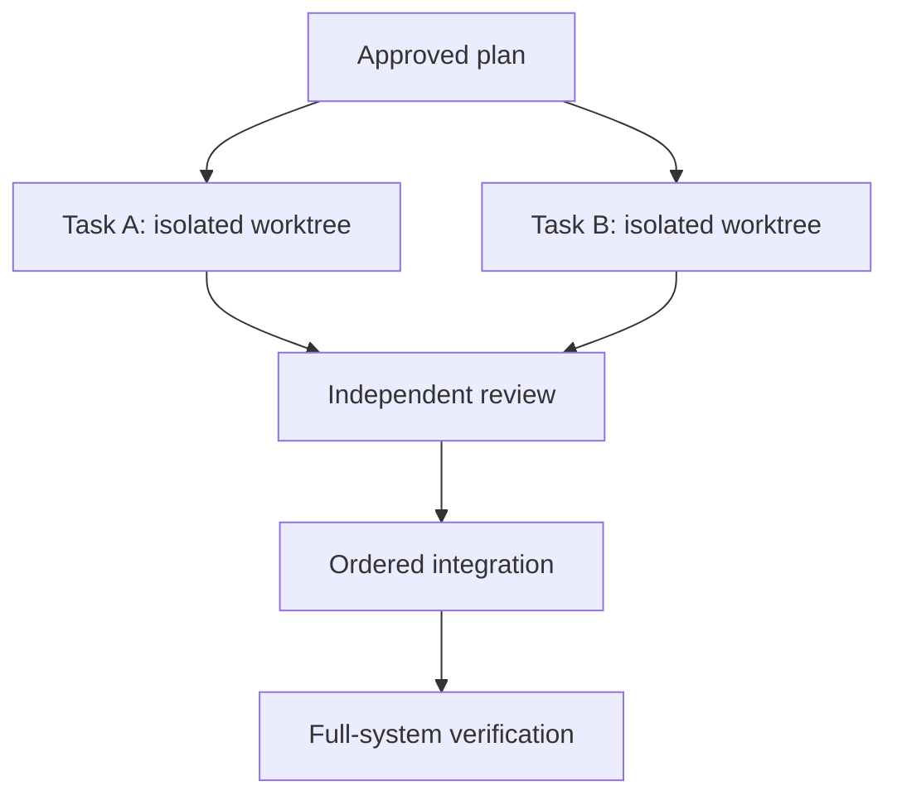

# Multi-Agent and Autonomous Execution

Parallel agents increase throughput only when work is decomposable and integration is controlled.

## Good autonomous tasks

- have explicit scope and exclusions;
- fit within one bounded context;
- produce an objective success signal;
- touch a predictable set of files;
- can run in an isolated branch or worktree;
- have a capped number of iterations;
- can fail safely without damaging shared systems.

## Bad autonomous tasks

- “Improve the architecture.”
- “Make the product enterprise-ready.”
- ambiguous UI or product decisions;
- destructive migrations without supervision;
- changes requiring production credentials;
- several workers editing the same core abstraction;
- work whose tests can be trivially gamed.

## Parallelization model

Map dependencies and shared files before starting workers. Parallelize independent leaves, not architectural decisions.

## Required safeguards

- least-privilege permissions;
- explicit never-touch paths;
- clean baseline before execution;
- time, token, cost, and iteration caps;
- atomic commits and recoverable workspaces;
- deterministic validation after every task;
- review that cannot silently change the requirement;
- human approval for high-impact actions.

## Frameworks to study

- [GSD Core](../frameworks/gsd-core.md): fresh-context phased execution.
- [Superpowers](../frameworks/superpowers.md): subagent implementation and two-stage review.
- [Ralphy](../frameworks/ralphy.md): task and PRD loops across several coding agents.
- [cc-sdd](../frameworks/cc-sdd.md): per-task implementation, review, and debugging.
- [Archon](../frameworks/archon.md): deterministic YAML workflows and approval gates.
